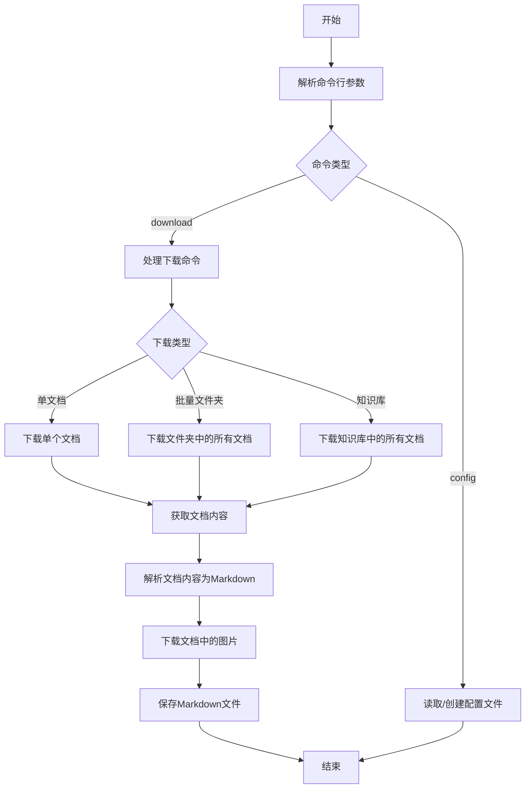
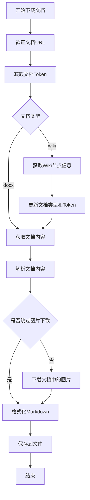
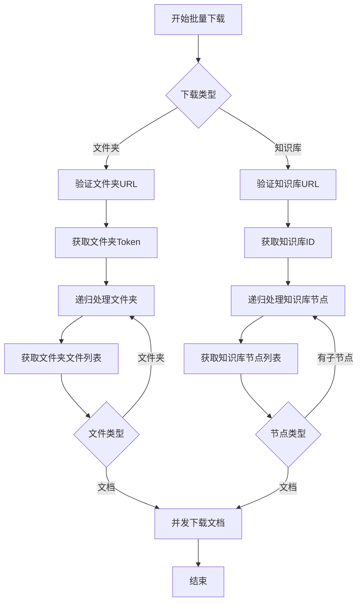
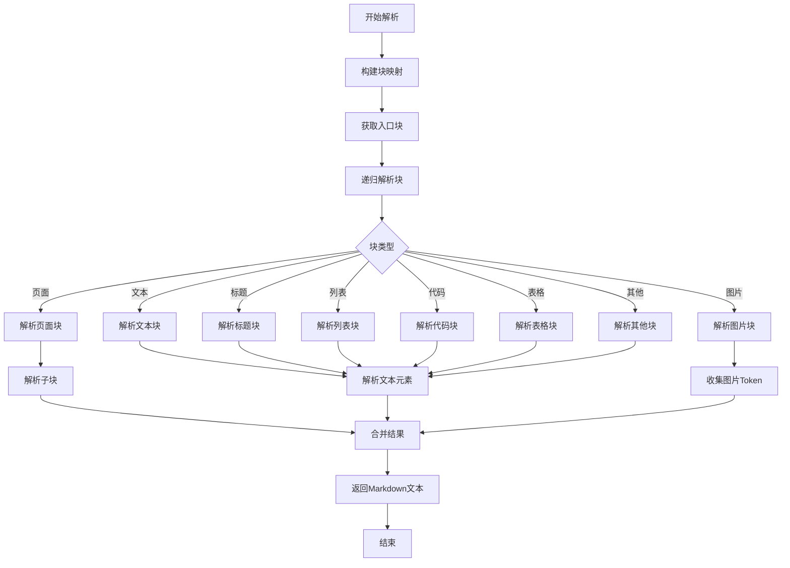

# feishu2md 项目架构文档

## 项目概述

feishu2md 是一个将飞书文档转换为 Markdown 格式的工具，使用 Go 语言实现。该工具支持命令行和 Web 界面两种使用方式，可以下载单个文档、批量下载文件夹中的文档或下载整个知识库的文档。

## 主要功能模块

### 1. 配置管理模块

- **功能**：管理应用的配置信息，包括飞书 API 的 AppID 和 AppSecret，以及输出相关的配置
- **核心文件**：`core/config.go`
- **主要结构**：
  - `Config`：包含飞书配置和输出配置
  - `FeishuConfig`：存储 AppID 和 AppSecret
  - `OutputConfig`：控制输出行为，如图片目录、是否使用文档标题作为文件名等

### 2. 客户端模块

- **功能**：与飞书 API 交互，获取文档内容、下载图片等
- **核心文件**：`core/client.go`
- **主要方法**：
  - `GetDocxContent`：获取文档内容
  - `DownloadImage`：下载文档中的图片
  - `GetDriveFolderFileList`：获取文件夹中的文件列表
  - `GetWikiNodeList`：获取知识库节点列表

### 3. 解析器模块

- **功能**：将飞书文档的内容解析为 Markdown 格式
- **核心文件**：`core/parser.go`
- **主要方法**：
  - `ParseDocxContent`：解析文档内容
  - `ParseDocxBlock`：解析文档块
  - 各种特定块类型的解析方法：如标题、列表、代码块、表格等

### 4. 命令行接口模块

- **功能**：提供命令行界面，处理用户输入的命令
- **核心文件**：`cmd/main.go`、`cmd/config.go`、`cmd/download.go`
- **主要命令**：
  - `config`：配置 AppID 和 AppSecret
  - `download`/`dl`：下载文档为 Markdown

### 5. Web 界面模块

- **功能**：提供 Web 界面，方便用户在浏览器中使用
- **核心文件**：`web/main.go`、`web/download.go`
- **主要功能**：通过 Web 界面上传文档链接，下载为 Markdown

## 执行流程

### 命令行模式执行流程



### 单文档下载流程



### 批量下载流程



### 文档解析流程



## 配置文件结构

```json
{
  "feishu": {
    "app_id": "your_app_id",
    "app_secret": "your_app_secret"
  },
  "output": {
    "image_dir": "static",
    "title_as_filename": false,
    "use_html_tags": false,
    "skip_img_download": false
  }
}
```

## 项目依赖

- [chyroc/lark](https://github.com/chyroc/lark)：飞书 API 客户端
- [urfave/cli](https://github.com/urfave/cli)：命令行界面框架
- [88250/lute](https://github.com/88250/lute)：Markdown 处理器
- [olekukonko/tablewriter](https://github.com/olekukonko/tablewriter)：表格渲染