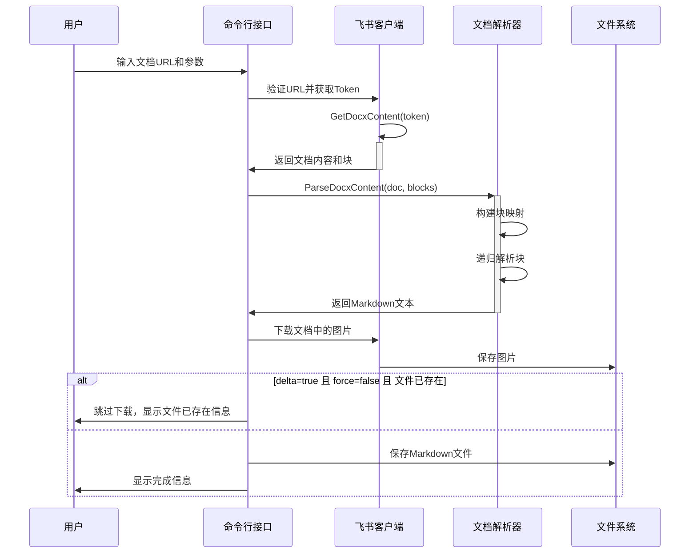
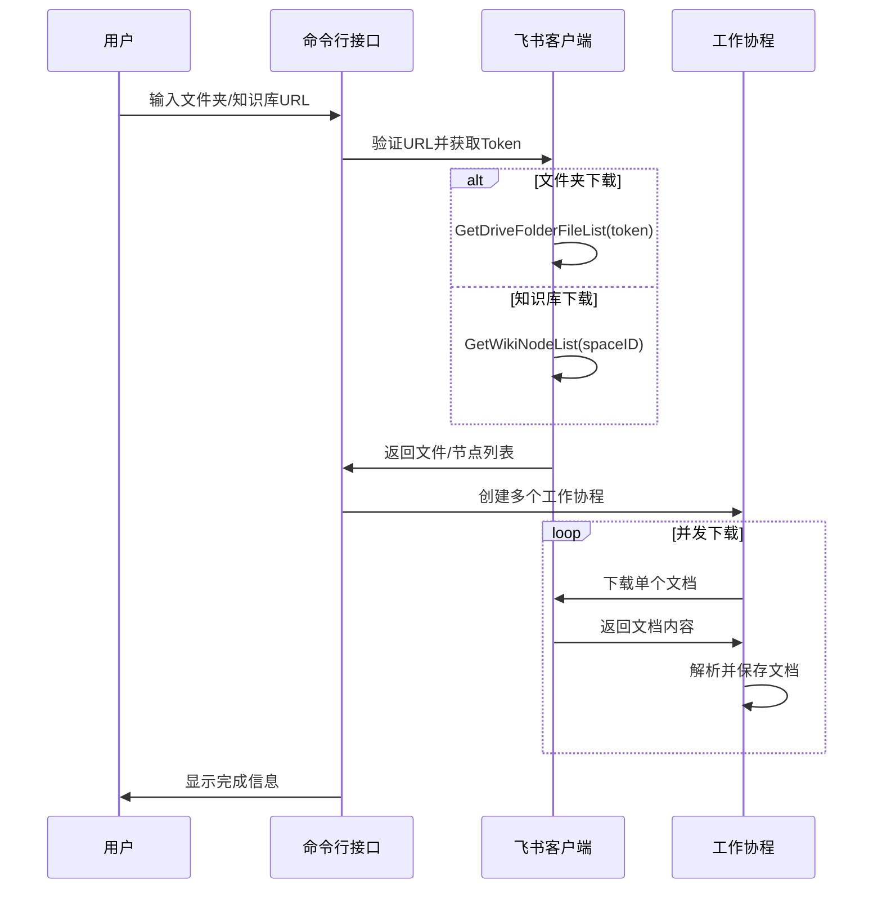
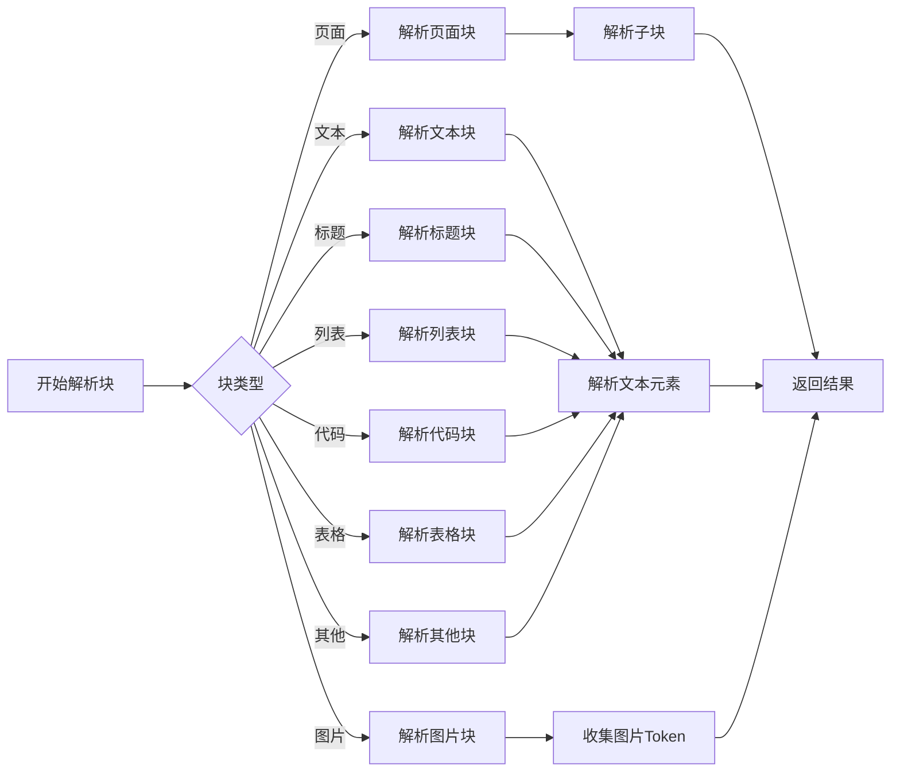

# feishu2md 技术实现文档

## 核心组件实现

### 1. 配置管理

配置管理模块负责处理应用的配置信息，包括飞书 API 的凭证和输出相关的设置。

#### 配置结构

```go
type Config struct {
    Feishu FeishuConfig `json:"feishu"`
    Output OutputConfig `json:"output"`
}

type FeishuConfig struct {
    AppId     string `json:"app_id"`
    AppSecret string `json:"app_secret"`
}

type OutputConfig struct {
    ImageDir        string `json:"image_dir"`
    TitleAsFilename bool   `json:"title_as_filename"`
    UseHTMLTags     bool   `json:"use_html_tags"`
    SkipImgDownload bool   `json:"skip_img_download"`
	Delta           bool   `json:"delta"`
}
```

#### 配置文件管理

- 配置文件存储在用户配置目录下的 `feishu2md/config.json`
- 通过 `GetConfigFilePath()` 获取配置文件路径
- 通过 `ReadConfigFromFile()` 读取配置
- 通过 `WriteConfig2File()` 写入配置

### 2. 飞书客户端

客户端模块封装了与飞书 API 的交互，使用 [chyroc/lark](https://github.com/chyroc/lark) 库实现。

#### 客户端初始化

```go
func NewClient(appID, appSecret string) *Client {
    return &Client{
        larkClient: lark.New(
            lark.WithAppCredential(appID, appSecret),
            lark.WithTimeout(60*time.Second),
            lark.WithApiMiddleware(lark_rate_limiter.Wait(4, 4)),
        ),
    }
}
```

#### 主要功能

- **获取文档内容**：`GetDocxContent` 方法获取文档的元数据和内容块
- **下载图片**：`DownloadImage` 方法下载文档中的图片
- **获取文件夹内容**：`GetDriveFolderFileList` 方法获取文件夹中的文件列表
- **获取知识库内容**：`GetWikiNodeList` 方法获取知识库节点列表

### 3. 文档解析器

解析器模块负责将飞书文档的内容转换为 Markdown 格式。

#### 解析器初始化

```go
func NewParser(config OutputConfig) *Parser {
    return &Parser{
        useHTMLTags: config.UseHTMLTags,
        ImgTokens:   make([]string, 0),
        blockMap:    make(map[string]*lark.DocxBlock),
    }
}
```

#### 解析流程

1. **构建块映射**：将文档的所有块存储在映射中，以便快速访问
2. **获取入口块**：从文档 ID 获取入口块
3. **递归解析**：从入口块开始，递归解析所有块

```go
func (p *Parser) ParseDocxContent(doc *lark.DocxDocument, blocks []*lark.DocxBlock) string {
    for _, block := range blocks {
        p.blockMap[block.BlockID] = block
    }

    entryBlock := p.blockMap[doc.DocumentID]
    return p.ParseDocxBlock(entryBlock, 0)
}
```

#### 块类型解析

解析器支持多种块类型的解析，包括：

- **页面块**：文档的主体
- **文本块**：普通文本内容
- **标题块**：各级标题
- **列表块**：有序和无序列表
- **代码块**：代码片段，支持多种语言
- **表格块**：表格内容
- **图片块**：图片，需要下载并替换链接
- **引用块**：引用内容
- **公式块**：数学公式
- **待办事项**：任务列表

### 4. 命令行接口

命令行接口使用 [urfave/cli](https://github.com/urfave/cli) 库实现，提供了两个主要命令：

#### config 命令

用于配置 AppID 和 AppSecret，或查看当前配置。

```go
{
    Name:  "config",
    Usage: "Read config file or set field(s) if provided",
    Flags: []cli.Flag{
        &cli.StringFlag{
            Name:        "appId",
            Value:       "",
            Usage:       "Set app id for the OPEN API",
            Destination: &configOpts.appId,
        },
        &cli.StringFlag{
            Name:        "appSecret",
            Value:       "",
            Usage:       "Set app secret for the OPEN API",
            Destination: &configOpts.appSecret,
        },
    },
    Action: func(ctx *cli.Context) error {
        return handleConfigCommand()
    },
}
```

#### download 命令

用于下载文档、文件夹或知识库。

```go
{
    Name:    "download",
    Aliases: []string{"dl"},
    Usage:   "Download feishu/larksuite document to markdown file",
    Flags: []cli.Flag{
        &cli.StringFlag{
            Name:        "output",
            Aliases:     []string{"o"},
            Value:       "./",
            Usage:       "Specify the output directory for the markdown files",
            Destination: &dlOpts.outputDir,
        },
        &cli.BoolFlag{
            Name:        "dump",
            Value:       false,
            Usage:       "Dump json response of the OPEN API",
            Destination: &dlOpts.dump,
        },
        &cli.BoolFlag{
            Name:        "batch",
            Value:       false,
            Usage:       "Download all documents under a folder",
            Destination: &dlOpts.batch,
        },
        &cli.BoolFlag{
            Name:        "wiki",
            Value:       false,
            Usage:       "Download all documents within the wiki.",
            Destination: &dlOpts.wiki,
        },
        &cli.BoolFlag{
            Name:        "force",
            Value:       false,
            Usage:       "Force download even if file already exists (ignore delta config)",
            Destination: &dlOpts.force,
        },
    },
    Action: func(ctx *cli.Context) error {
        if ctx.NArg() == 0 {
            return cli.Exit("Please specify the document/folder/wiki url", 1)
        } else {
            url := ctx.Args().First()
            return handleDownloadCommand(url)
        }
    },
}
```

### 5. Web 界面

Web 界面使用 Gin 框架实现，提供了一个简单的 Web 页面，用户可以在其中输入文档链接并下载为 Markdown。

## 关键算法和流程

### 1. 文档下载流程



### 2. 批量下载流程



### 3. 块解析算法



## 性能优化

### 1. 并发下载

在批量下载文件夹或知识库时，使用 Go 的协程和通道实现并发下载，提高下载效率。

```go
// 并发下载示例
wg.Add(1)
go func(_url string) {
    if err := downloadDocument(ctx, client, _url, &opts); err != nil {
        errChan <- err
    }
    wg.Done()
}(file.URL)
```

### 2. 限流控制

使用 `lark_rate_limiter` 中间件控制 API 请求速率，避免触发飞书 API 的限流。

```go
lark.WithApiMiddleware(lark_rate_limiter.Wait(4, 4))
```

### 3. 分页获取

对于大型文档或文件夹，使用分页方式获取内容，避免一次性请求过多数据。

```go
// 分页获取文档块
var pageToken *string
for {
    resp2, _, err := c.larkClient.Drive.GetDocxBlockListOfDocument(ctx, &lark.GetDocxBlockListOfDocumentReq{
        DocumentID: docx.DocumentID,
        PageToken:  pageToken,
    })
    if err != nil {
        return docx, nil, err
    }
    blocks = append(blocks, resp2.Items...)
    pageToken = &resp2.PageToken
    if !resp2.HasMore {
        break
    }
}
```

## 错误处理

项目中使用了多种错误处理机制：

1. **返回错误**：大多数函数返回错误，由调用者处理
2. **错误通道**：在并发操作中使用错误通道收集错误
3. **检查工具**：使用 `utils.CheckErr()` 函数检查关键错误

```go
// 错误通道示例
errChan := make(chan error)
wg := sync.WaitGroup{}

// 等待所有下载完成并处理错误
go func() {
    wg.Wait()
    close(errChan)
}()
for err := range errChan {
    return err
}
```

## 扩展性设计

### 1. 模块化结构

项目采用模块化结构，核心功能分离为独立的包：

- `core`：核心功能，包括配置、客户端和解析器
- `cmd`：命令行接口
- `web`：Web 界面
- `utils`：通用工具函数

### 2. 可配置选项

通过配置文件和命令行参数提供多种可配置选项，如：

- 输出目录
- 图片处理方式
- 文件命名方式
- **skip_img_download**：是否跳过图片下载
- **delta**：当文件已存在时是否跳过下载（默认为 true）


### 3. 支持多种文档类型

支持处理多种飞书文档类型：

- 文档（docx）
- 文件夹
- 知识库

## 未来可能的改进

1. **支持更多格式**：增加对更多输出格式的支持，如 HTML、PDF 等
2. **增强解析能力**：支持更复杂的文档结构和格式
3. **改进错误处理**：提供更详细的错误信息和恢复机制
4. **优化性能**：进一步优化大型文档和批量下载的性能
5. **增强 Web 界面**：提供更丰富的 Web 界面功能，如预览、编辑等