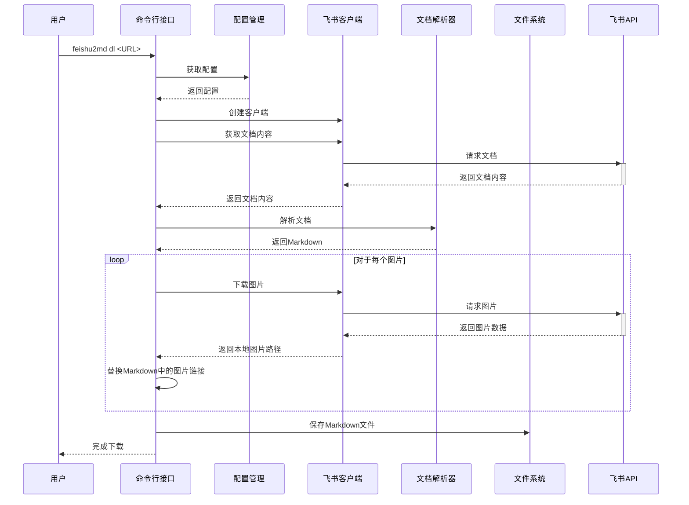
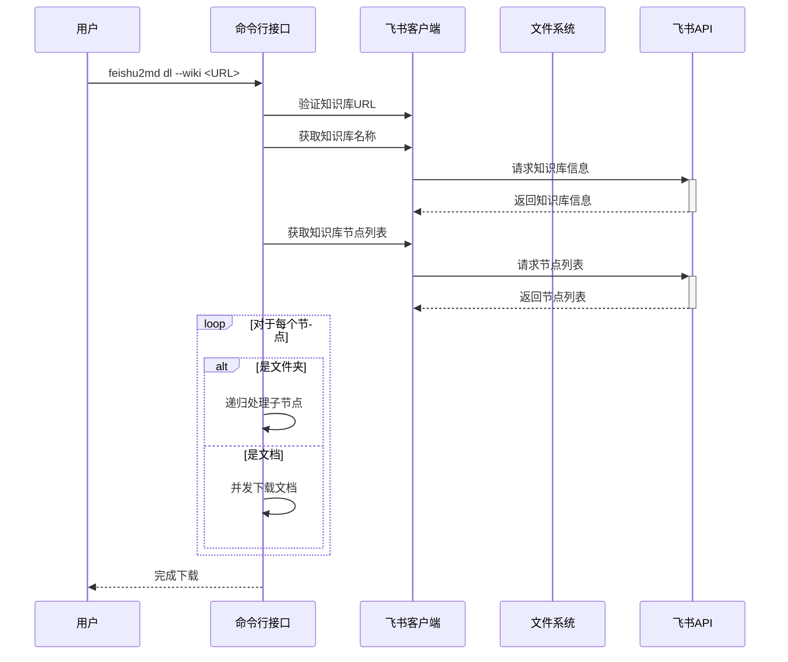
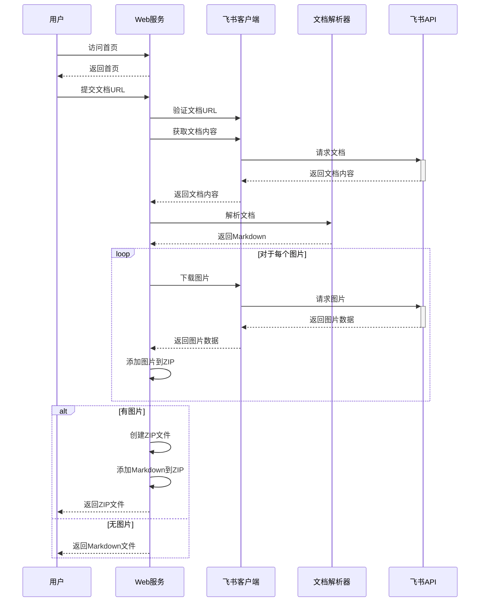

# feishu2md 功能模块详解

## 1. 命令行接口模块 (cmd)

### 1.1 main.go

`main.go` 是命令行工具的入口点，使用 `urfave/cli` 库实现命令行界面。主要功能包括：

- 定义应用基本信息（名称、版本、用途）
- 注册主要命令：`config` 和 `download`（别名 `dl`）
- 为每个命令定义参数和标志
- 设置命令处理函数

命令结构：
- `feishu2md config`: 读取或设置配置文件
  - `--appId`: 设置飞书 Open API 的 App ID
  - `--appSecret`: 设置飞书 Open API 的 App Secret

- `feishu2md download` (或 `feishu2md dl`): 下载飞书文档并转换为 Markdown
  - `--output`, `-o`: 指定输出目录
  - `--dump`: 导出 API 响应的 JSON 数据
  - `--batch`: 下载文件夹下的所有文档
  - `--wiki`: 下载知识库中的所有文档
  - `--force`: 强制下载（忽略增量配置）
  - `--appId`: 设置 App ID（覆盖配置文件）
  - `--appSecret`: 设置 App Secret（覆盖配置文件）

### 1.2 config.go

`config.go` 处理配置相关的命令，主要功能包括：

- 定义配置选项结构体 `ConfigOpts`
- 实现 `handleConfigCommand` 函数，用于处理配置命令
  - 获取配置文件路径
  - 检查配置文件是否存在
  - 如果不存在，创建默认配置
  - 如果存在，读取现有配置
  - 如果提供了新的 App ID 或 App Secret，更新配置
  - 显示当前配置内容

### 1.3 download.go

`download.go` 实现文档下载的核心功能，包括：

- 定义下载选项结构体 `DownloadOpts`
- 实现 `handleDownloadCommand` 函数，处理下载命令
  - 加载或创建配置
  - 创建飞书客户端
  - 根据下载类型调用相应的下载函数

- 实现 `downloadDocument` 函数，下载单个文档
  - 验证文档 URL
  - 获取文档内容
  - 解析为 Markdown
  - 下载文档中的图片
  - 保存 Markdown 文件

- 实现 `downloadDocuments` 函数，批量下载文件夹中的文档
  - 验证文件夹 URL
  - 递归获取文件夹内容
  - 并发下载文档

- 实现 `downloadWiki` 函数，下载知识库中的文档
  - 验证知识库 URL
  - 获取知识库名称
  - 递归下载知识库节点
  - 使用信号量限制并发下载

## 2. 核心功能模块 (core)

### 2.1 client.go

`client.go` 封装与飞书 API 的交互，提供以下功能：

- 定义 `Client` 结构体，封装 `lark.Lark` 客户端
- 实现 `NewClient` 函数，创建客户端实例
  - 设置 App ID 和 App Secret
  - 设置超时和速率限制

- 实现与飞书 API 交互的方法：
  - `DownloadImage`: 下载图片并保存到本地
  - `DownloadImageRaw`: 下载图片并返回字节数据
  - `GetDocxContent`: 获取文档内容和块列表
  - `GetWikiNodeInfo`: 获取知识库节点信息
  - `GetDriveFolderFileList`: 获取文件夹中的文件列表
  - `GetWikiName`: 获取知识库名称
  - `GetWikiNodeList`: 获取知识库节点列表

### 2.2 config.go

`config.go` 定义配置结构和配置文件操作，包括：

- 定义配置结构体：
  - `Config`: 顶层配置结构
  - `FeishuConfig`: 飞书 API 配置
  - `OutputConfig`: 输出配置

- 实现配置相关的函数：
  - `NewConfig`: 创建默认配置
  - `GetConfigFilePath`: 获取配置文件路径
  - `ReadConfigFromFile`: 从文件读取配置
  - `WriteConfig2File`: 将配置写入文件

### 2.3 parser.go

`parser.go` 实现飞书文档到 Markdown 的转换，包括：

- 定义 `Parser` 结构体，存储解析状态和图片令牌
- 实现 `NewParser` 函数，创建解析器实例

- 实现文档解析的方法：
  - `ParseDocxContent`: 解析文档内容
  - `ParseDocxBlock`: 解析文档块
  - 针对不同类型的块实现特定的解析方法：
    - 文本块、标题块、列表块、代码块、引用块
    - 图片块、表格块、分割线、待办事项等

## 3. Web 服务模块 (web)

### 3.1 main.go

`main.go` 是 Web 服务的入口点，使用 `gin` 框架实现 Web 服务，主要功能包括：

- 嵌入模板文件
- 初始化 Gin 路由器
- 设置路由：
  - `/`: 显示首页
  - `/download`: 处理下载请求
- 启动 Web 服务

### 3.2 download.go

`download.go` 处理 Web 界面的文档下载请求，主要功能包括：

- 实现 `downloadHandler` 函数，处理下载请求
  - 解析请求参数
  - 验证文档 URL
  - 创建客户端
  - 获取文档内容
  - 解析为 Markdown
  - 下载文档中的图片
  - 根据是否有图片，返回 Markdown 文件或包含图片的 ZIP 文件

## 4. 工具函数模块 (utils)

### 4.1 url.go

`url.go` 提供 URL 验证和处理功能，包括：

- `UnescapeURL`: 解码 URL
- `ValidateDocumentURL`: 验证文档 URL 格式，提取文档类型和令牌
- `ValidateFolderURL`: 验证文件夹 URL 格式，提取文件夹令牌
- `ValidateWikiURL`: 验证知识库 URL 格式，提取前缀 URL 和知识库令牌

### 4.2 common.go

`common.go` 提供通用工具函数，包括错误处理、JSON 格式化等功能。

## 5. 关键流程详解

### 5.1 单文档下载流程



### 5.2 知识库下载流程



### 5.3 Web 服务下载流程



## 6. 配置文件详解

配置文件结构：

```json
{
  "feishu": {
    "app_id": "飞书应用的App ID",
    "app_secret": "飞书应用的App Secret"
  },
  "output": {
    "image_dir": "static",       // 图片保存目录
    "title_as_filename": true,   // 使用文档标题作为文件名
    "use_html_tags": false,      // 使用HTML标签而非Markdown语法
    "skip_img_download": false,  // 跳过图片下载
    "delta": true               // 增量下载，跳过已存在的文件
  }
}
```

配置文件位置：
- Windows: `%AppData%/feishu2md/config.json`
- Linux: `$XDG_CONFIG_HOME/feishu2md/config.json` 或 `~/.config/feishu2md/config.json`
- Mac: `$XDG_CONFIG_HOME/feishu2md/config.json` 或 `~/.config/feishu2md/config.json`