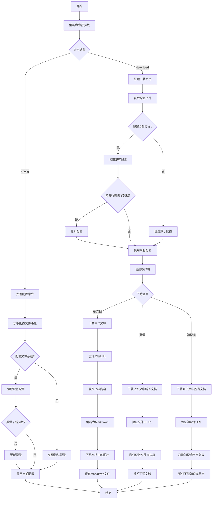
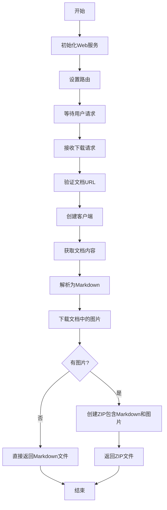
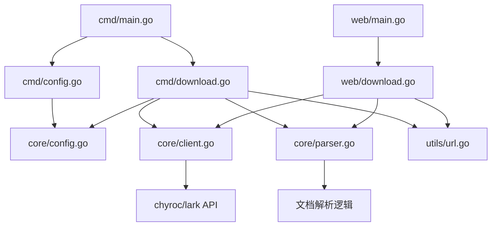
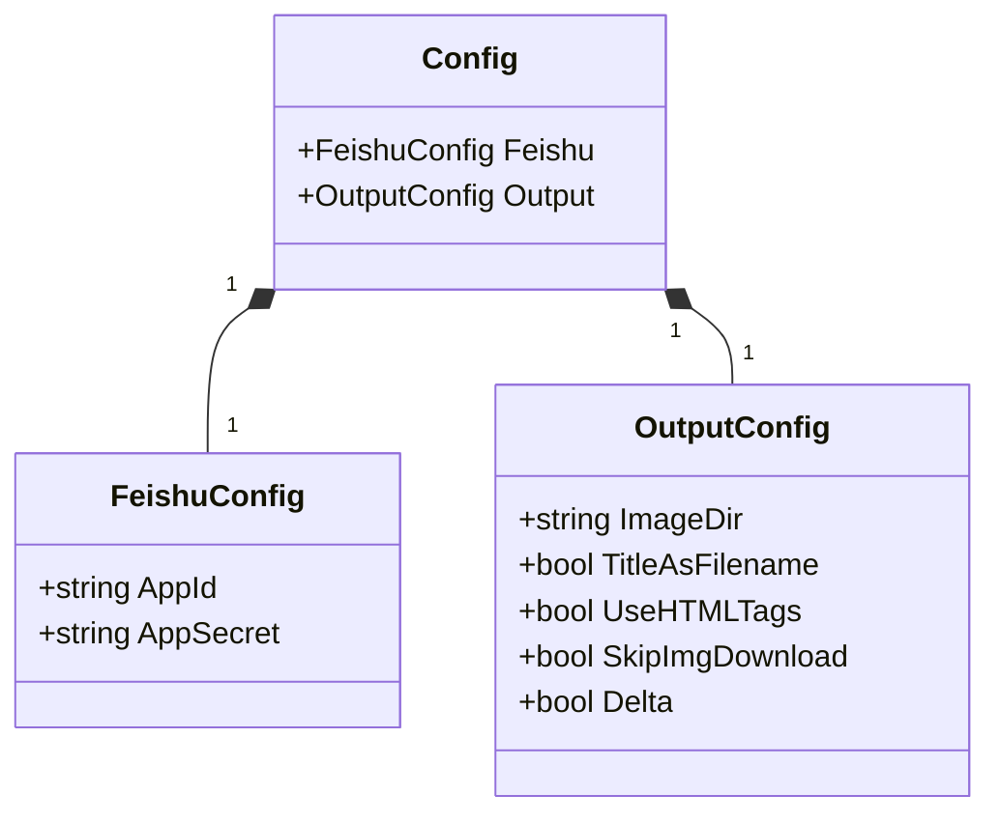

# feishu2md 项目概述

## 项目简介

feishu2md 是一个用于将飞书文档转换为 Markdown 格式的工具，使用 Go 语言实现。该工具支持通过命令行或 Web 服务的方式，下载单个飞书文档、批量下载文件夹中的文档或下载整个知识库的文档，并将其转换为 Markdown 格式。

## 主要功能模块

根据代码分析，feishu2md 项目主要包含以下功能模块：

### 1. 命令行接口模块 (cmd)

- **main.go**: 定义命令行工具的入口点和主要命令结构
- **config.go**: 处理配置文件的读取、创建和更新
- **download.go**: 实现文档下载的核心功能，包括单文档下载、批量下载和知识库下载

### 2. 核心功能模块 (core)

- **client.go**: 封装与飞书 API 的交互，提供文档获取、图片下载等功能
- **config.go**: 定义配置结构和配置文件操作
- **parser.go**: 解析飞书文档内容，将其转换为 Markdown 格式

### 3. Web 服务模块 (web)

- **main.go**: Web 服务的入口点，设置路由和模板
- **download.go**: 处理 Web 界面的文档下载请求

### 4. 工具函数模块 (utils)

- **url.go**: 提供 URL 验证和处理功能
- **common.go**: 提供通用工具函数

## 执行流程

### 命令行模式执行流程

### Web 服务模式执行流程

## 核心数据流

## 模块依赖关系

## 配置文件结构

